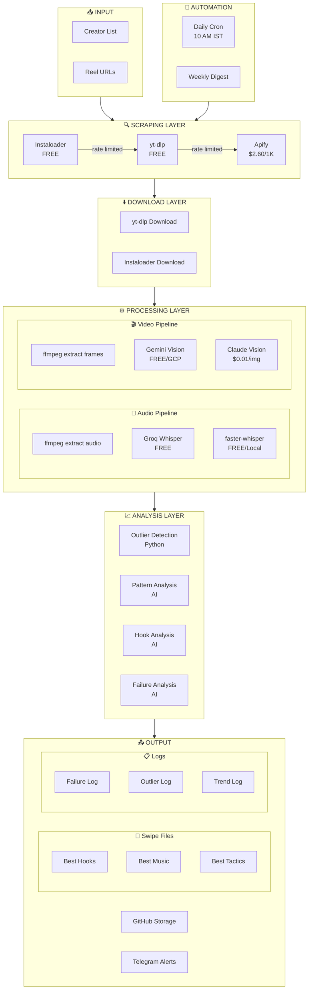
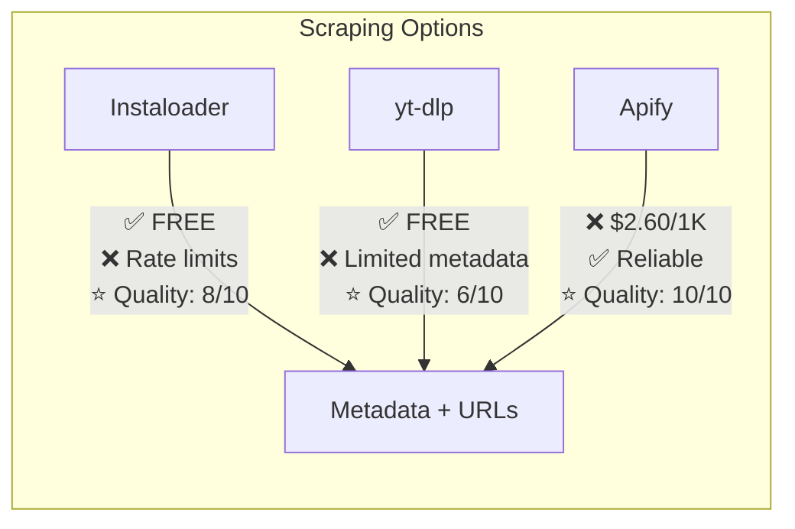
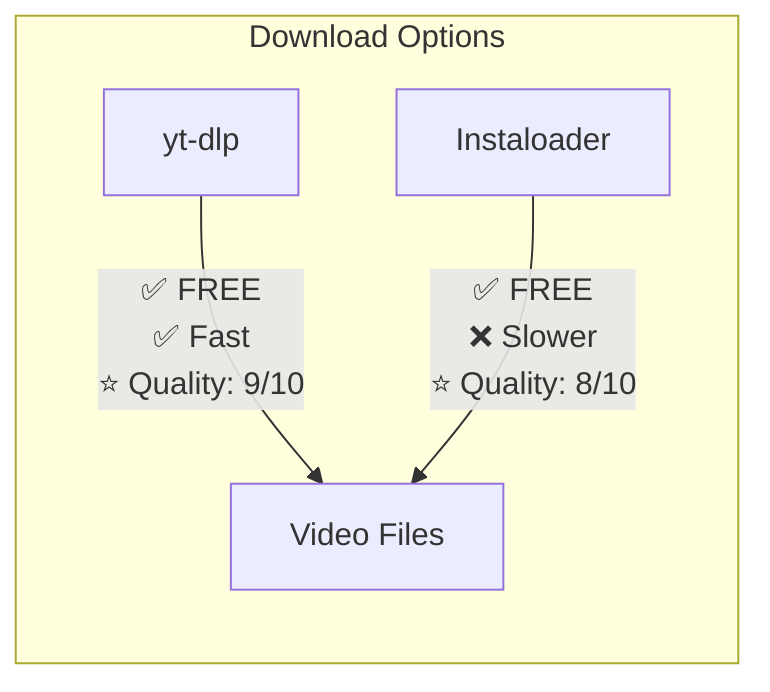
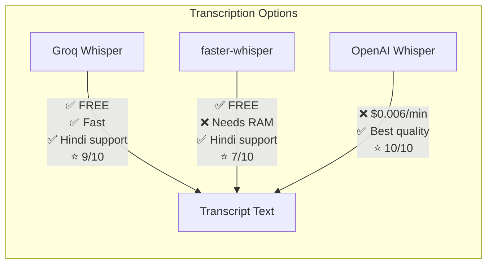
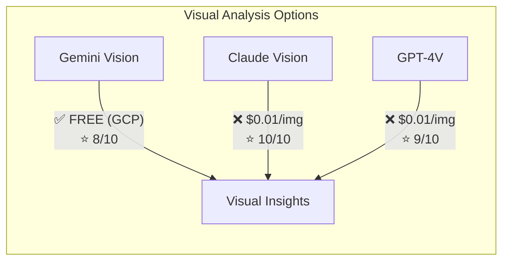
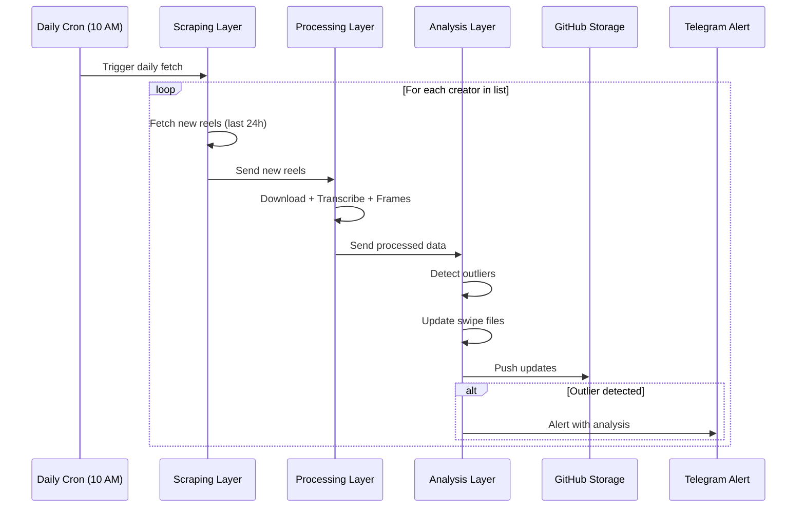

# Instagram Intel System — System Design Document

**Created:** March 3, 2026  
**Status:** Design Phase  
**Author:** Mohana

---

## 🎯 SYSTEM GOALS

1. **Scrape** — Fetch metadata + videos from Instagram reels
2. **Transcribe** — Convert audio to text (including Hindi)
3. **Visual Analysis** — Extract frames, detect hooks, text overlays
4. **Pattern Detection** — Find what works, build swipe files
5. **Failure Analysis** — Track what didn't work
6. **Daily Automation** — Monitor creators, detect outliers
7. **Storage** — GitHub-based knowledge base

---

## 📊 SYSTEM ARCHITECTURE



---

## 🔧 COMPONENT BREAKDOWN

### Layer 1: Scraping



| Tool | Cost | Rate Limits | Metadata Quality | Video URLs | Score |
|------|------|-------------|------------------|------------|-------|
| Instaloader | FREE | Yes (IG) | High | Yes | ?/100 |
| yt-dlp | FREE | Minimal | Medium | Yes | ?/100 |
| Apify | $2.60/1K | No | Very High | Yes | ?/100 |

### Layer 2: Download



### Layer 3: Transcription



### Layer 4: Visual Analysis



### Layer 5: Analysis

**What we're analyzing:**

| Category | Metrics | Output |
|----------|---------|--------|
| **Hook Analysis** | First 3 sec, opening line, visual hook | Swipe file |
| **Success Patterns** | Outlier score, engagement rate, virality | Pattern table |
| **Music/Audio** | Trending sounds, music choices | Music swipe |
| **Tactics** | CTAs, text overlays, pacing | Tactics log |
| **Failures** | Low performers, what didn't work | Failure log |
| **Trends** | What's working THIS week | Trend log |

---

## 📁 GITHUB STORAGE STRUCTURE

```
mohanagsk/second-brain/
└── areas/
    └── instagram/
        ├── PLANNING.md
        ├── SYSTEM_DESIGN.md
        ├── analysis/
        │   ├── data/           # Raw JSON data
        │   └── reports/        # Markdown reports
        ├── swipe-files/
        │   ├── hooks.md        # Best hooks
        │   ├── music.md        # Best music/sounds
        │   └── tactics.md      # Best tactics
        ├── logs/
        │   ├── failures.md     # What didn't work
        │   ├── outliers.md     # Outlier tracking
        │   └── trends.md       # Weekly trends
        └── creators/
            ├── divy.kairoth.md
            ├── vedikabhaia.md
            └── jaykapoor.24.md
```

---

## 🔄 DAILY AUTOMATION FLOW



---

## 🧪 TESTING PLAN

### Test 1: Scraping Comparison
**Goal:** Score Instaloader vs yt-dlp vs Apify

| Metric | Weight |
|--------|--------|
| Success rate | 30% |
| Speed | 20% |
| Metadata quality | 25% |
| Cost | 25% |

**Test data:** 10 reels from @divy.kairoth

### Test 2: Download Comparison
**Goal:** Score yt-dlp vs Instaloader for downloading

| Metric | Weight |
|--------|--------|
| Success rate | 40% |
| Speed | 30% |
| Quality | 30% |

**Test data:** 10 reels

### Test 3: Transcription Quality
**Goal:** Verify Groq Whisper works for Hindi

| Metric | Weight |
|--------|--------|
| Accuracy (Hindi) | 50% |
| Speed | 25% |
| Cost | 25% |

**Test data:** 5 Hindi reels

### Test 4: Vision Analysis
**Goal:** Compare Gemini vs Claude for visual analysis

| Metric | Weight |
|--------|--------|
| Hook detection | 30% |
| Text extraction | 25% |
| Scene analysis | 25% |
| Cost | 20% |

**Test data:** 5 reels with text overlays

---

## 🔍 EXISTING TOOLS RESEARCH

### ClawHub Skills to Inspect

| Skill | What it does | Useful for |
|-------|--------------|------------|
| `instagram-analyzer` | Engagement metrics | Scraping |
| `instagram-search` | Search functionality | Discovery |
| `faster-whisper-transcribe` | Local transcription | Audio |
| `assemblyai-transcribe` | Cloud transcription | Audio |

### GitHub Repos to Check

| Repo | What it does |
|------|--------------|
| `instaloader/instaloader` | Official scraper |
| `yt-dlp/yt-dlp` | Video downloader |
| `Avnsh1111/Instagram-Reels-Scraper` | Reels + analytics |

---

## ❓ INFORMATION NEEDED

1. **Instagram session** — For Instaloader (may need login cookies)
2. **Groq API key** — Already have ✅
3. **Gemini API** — Already have ✅
4. **Claude Vision** — Part of existing subscription?
5. **Creator list** — Starting with: divy.kairoth, vedikabhaia, jaykapoor.24

---

## 📋 NEXT STEPS

1. [ ] Finalize this system design (get approval)
2. [ ] Inspect ClawHub skills (without installing)
3. [ ] Spawn parallel agents for tool comparison tests
4. [ ] Calculate scores for each tool
5. [ ] Build final optimized pipeline
6. [ ] Set up daily automation

---

*Document will be updated as tests complete*
